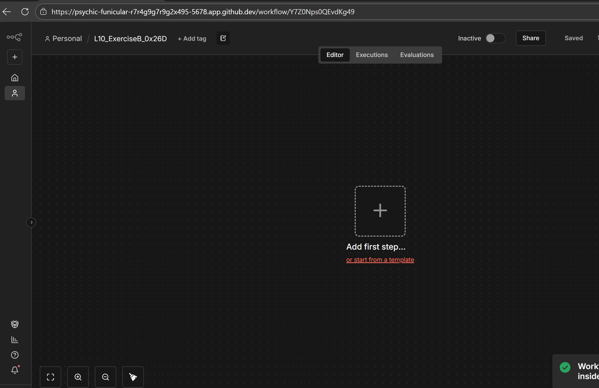
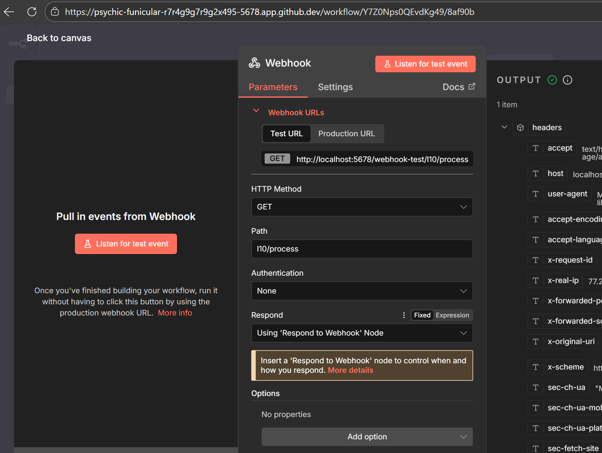
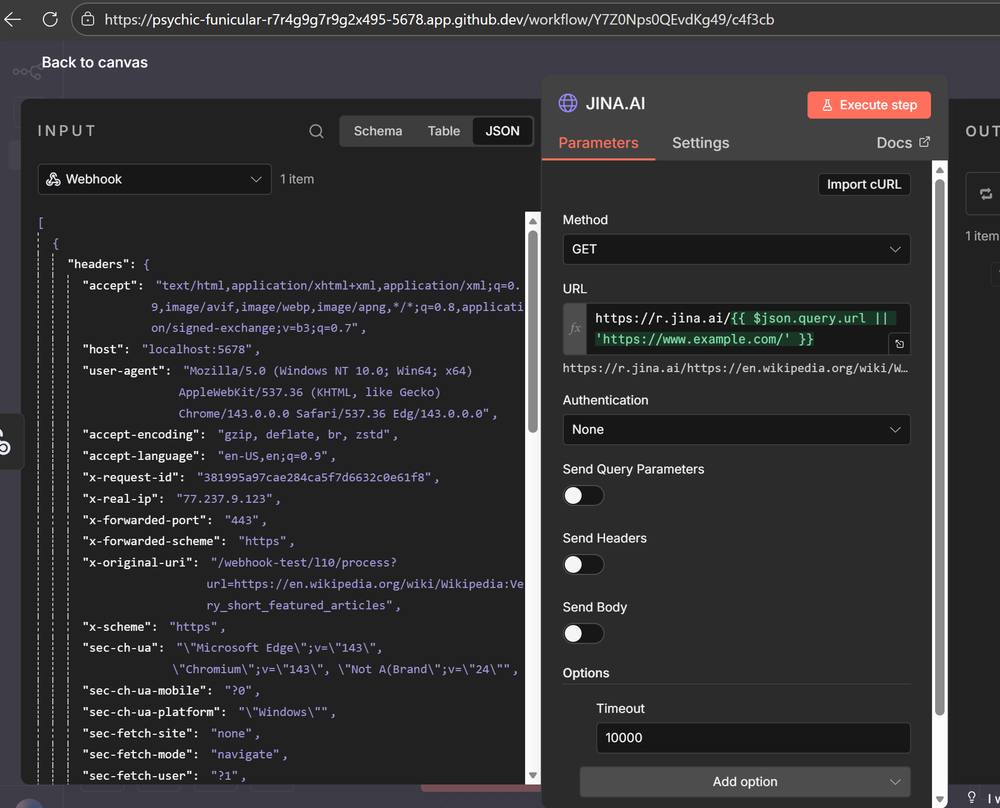
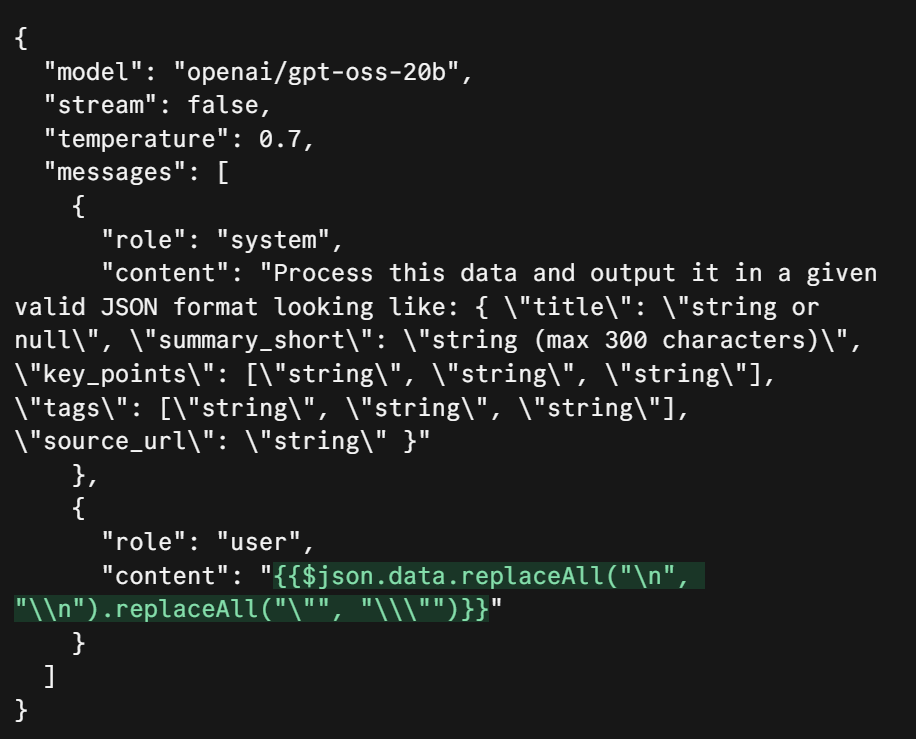
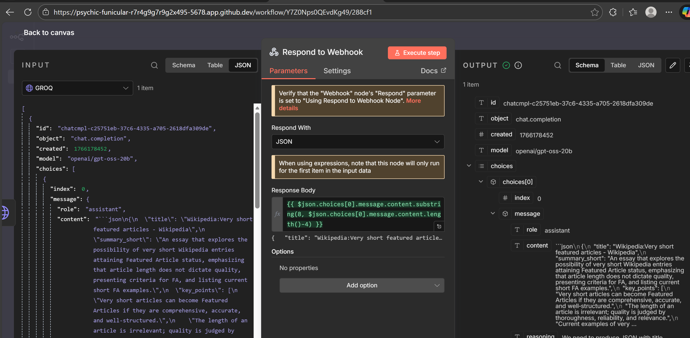
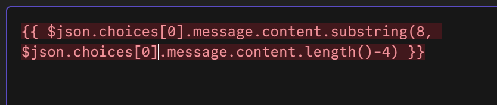
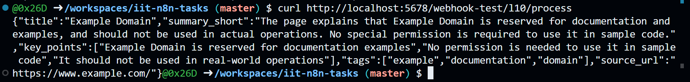
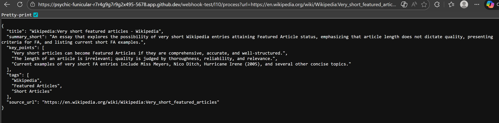

# Setup

# Nodes

GROQ node http request, replacing characters to not colide with JSON

Webhook responcs, just a substing of a responce

# Examples
default url

due to the ai wikipedia artice being too long (too many tokens) and n8n json methods and vsc shitting themselves while trying to debug it I chose a different, shorter wikipedia article
